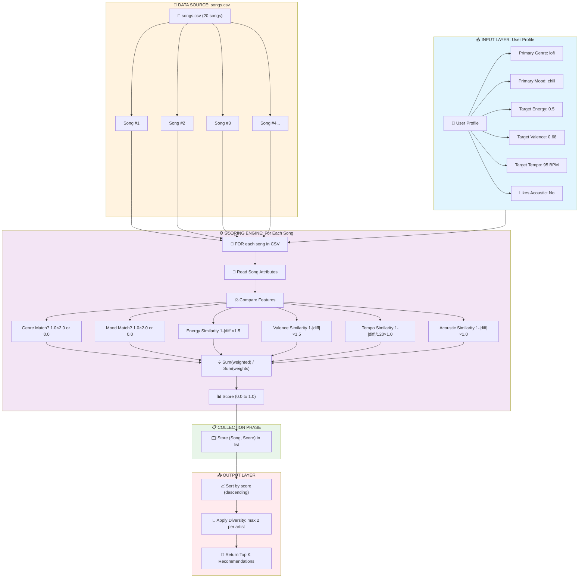

# 🎵 Music Recommender Simulation

## Project Summary

This project implements a **content-based music recommender system** that suggests songs based on a user's taste profile. Unlike collaborative filtering (which uses "people who liked X also liked Y"), our system uses song attributes like genre, mood, energy, valence, tempo, and acousticness to find matches.

Key components built:
- **UserProfile**: Captures preferred genres, moods, and target values for audio features
- **TasteProfile**: Detailed preference model with primary/secondary genres, mood ranges, energy tolerance, etc.
- **Scoring Rule**: Calculates similarity between user preferences and song attributes (0-1 score)
- **Ranking Rule**: Orders recommendations by score while enforcing diversity constraints (max 2 songs per artist)

We tested the system with multiple user profiles (pop fan, chill lofi user, workout enthusiast, jazz lover) and analyzed how different features affect recommendations.

---

## How The System Works

Our content-based recommender matches song features to user preferences through a three-stage process:

```
┌─────────────────────────────────────────────────────────────────────────────┐
│                         THE DATA FLOW                                        │
│                                                                              │
│   INPUT (User Prefs)  ──▶  PROCESS (Scoring Loop)  ──▶  OUTPUT (Ranked List) │
│                                                                              │
│   ┌──────────────┐         ┌─────────────────────┐         ┌─────────────┐  │
│   │ User Profile │   ──▶   │ For EACH song:      │   ──▶   │ Top K       │  │
│   │ • genre      │         │ • Read attributes   │         │ Songs       │  │
│   │ • mood       │         │ • Compare features  │         │ (sorted)    │  │
│   │ • energy     │         │ • Calculate score   │         │             │  │
│   │ • valence    │         │ • Store result      │         └─────────────┘  │
│   │ • tempo      │         └─────────────────────┘                          │
│   │ • acoustic   │               │                                            │
│   └──────────────┘               ▼                                            │
│                         ┌─────────────────────┐                              │
│                         │ After ALL scored:   │                              │
│                         │ • Sort by score    │                              │
│                         │ • Apply diversity  │                              │
│                         │ • Return top K     │                              │
│                         └─────────────────────┘                              │
└─────────────────────────────────────────────────────────────────────────────┘
```

### The Three Stages Explained

#### Stage 1: INPUT - User Preferences

The system starts with a **User Profile** that defines what kind of music the user likes:

| Attribute | Example Value | Meaning |
|-----------|---------------|---------|
| `favorite_genre` | "lofi" | User prefers lofi music |
| `favorite_mood` | "chill" | User wants calm, relaxed tracks |
| `target_energy` | 0.5 | Medium intensity (0=calm, 1=intense) |
| `target_valence` | 0.68 | Slightly positive emotional tone |
| `target_tempo` | 95 BPM | Slow-to-medium pace |
| `likes_acoustic` | False | No strong preference for acoustic |

#### Stage 2: PROCESS - Scoring Loop (For Each Song)

The system iterates through every song in the catalog and calculates a **similarity score (0.0 to 1.0)**:

```
For each song:
  1. Read song's attributes (genre, mood, energy, valence, tempo, acousticness)
  2. Compare to user preferences
  3. Calculate weighted similarity score
  4. Store (song, score) in a list
```

**The Scoring Formula:**
```
score = (weight × value) for all features / total_weight
```

| Feature | Weight | How It's Calculated |
|---------|--------|---------------------|
| Genre Match | 2.0 | 1.0 if matches, 0.0 if not |
| Mood Match | 2.0 | 1.0 if matches, 0.0 if not |
| Energy Similarity | 1.5 | 1.0 - \|user_energy - song_energy\| |
| Valence Similarity | 1.5 | 1.0 - \|user_valence - song_valence\| |
| Tempo Similarity | 1.0 | 1.0 - (\|user_tempo - song_tempo\| / 120) |
| Acoustic Similarity | 1.0 | 1.0 - \|target_acoustic - song_acoustic\| |

**Example: Scoring "Midnight Coding"**

```
Song: lofi, chill, energy=0.42, valence=0.56, tempo=78, acoustic=0.71
User: lofi, chill, energy=0.50, valence=0.68, tempo=95, acoustic=0.20

Genre match:   1.0 × 2.0 = 2.0
Mood match:    1.0 × 2.0 = 2.0
Energy:        (1 - |0.50-0.42|) × 1.5 = 1.38
Valence:       (1 - |0.68-0.56|) × 1.5 = 1.32
Tempo:         (1 - |95-78|/120) × 1.0 = 0.86
Acoustic:      (1 - |0.71-0.20|) × 1.0 = 0.49
─────────────────────────────────────
Total:         8.05
Weight sum:    9.0
Final score:   8.05 / 9.0 = 0.894 (89.4% match!)
```

#### Stage 3: OUTPUT - Ranking

After all songs are scored:

1. **Sort** by score (descending: highest first)
2. **Apply diversity**: Limit to max 2 songs per artist
3. **Return** top K recommendations

### Data Flow Flowchart



### Song Features Used

| Feature | Type | Description |
|---------|------|-------------|
| `genre` | Categorical | pop, lofi, rock, ambient, jazz, synthwave, indie pop, electronic |
| `mood` | Categorical | happy, chill, intense, relaxed, focused, moody, energetic, sad, romantic, dreamy |
| `energy` | Numerical (0-1) | Intensity level (0=calm, 1=intense) |
| `valence` | Numerical (0-1) | Emotional positivity (sad ↔ happy) |
| `tempo_bpm` | Numerical | Beats per minute (60-160 range) |
| `danceability` | Numerical (0-1) | How suitable for dancing |
| `acousticness` | Numerical (0-1) | Amount of acoustic instruments |

### UserProfile Structure

The basic user profile stores:
- **favorite_genre**: Primary genre the user enjoys
- **favorite_mood**: Primary mood the user seeks
- **target_energy**: Desired energy level (0.0-1.0)
- **likes_acoustic**: Whether user prefers acoustic music (boolean)
- **target_valence**: Desired emotional tone (0.0-1.0, default 0.7)
- **target_tempo**: Desired BPM (default 100.0)

### Christopher's Taste Profile

A more detailed profile includes:
- **Primary Genre**: lofi
- **Secondary Genres**: pop, ambient, synthwave, jazz
- **Primary Mood**: chill
- **Mood Range**: 40%-85% valence (wide range, from moody to happy)
- **Energy Preference**: 50% (±25% tolerance)
- **Valence Preference**: 68% (slightly positive)
- **Tempo Preference**: 95 BPM (±30 tolerance)
- **Acoustic Preference**: 55% (balanced)
- **Danceable Preference**: 58% (moderately danceable)
- **Favorite Artists**: LoRoom, Neon Echo, Orbit Bloom, Slow Stereo, Paper Lanterns
- **Avoided Attributes**: extremely_sad, overwhelmingly_loud

### Vibe Clusters Identified

| Vibe | Songs | Characteristics |
|------|-------|-----------------|
| Chill/Lofi | Midnight Coding, Library Rain, Focus Flow | Low energy (0.28-0.42), high acousticness |
| Happy Pop | Sunrise City, Rooftop Lights, Summer Party | High valence (0.81-0.89), high energy |
| Intense/Workout | Storm Runner, Gym Hero, Dance Floor | High energy (0.91-0.96), fast tempo |
| Moody Synthwave | Night Drive Loop, City Rain | Medium energy, low valence (0.41-0.49) |
| Ambient Chill | Ocean Waves, Spacewalk Thoughts, Sunrise Yoga | Very low energy (0.22-0.28), high acousticness |
| Sad/Jazz | Late Night Blues, Coffee Shop Stories | Low energy, low valence (0.25-0.28) |

---

## Getting Started

### Setup

1. Create a virtual environment (optional but recommended):

   ```bash
   python -m venv .venv
   source .venv/bin/activate      # Mac or Linux
   .venv\Scripts\activate         # Windows
   ```

2. Install dependencies

   ```bash
   pip install -r requirements.txt
   ```

3. Run the app:

   ```bash
   python -m src.main
   ```

### Running Tests

Run the starter tests with:

```bash
pytest
```

You can add more tests in `tests/test_recommender.py`.

---

## Experiments You Tried

### Experiment 1: Different User Profiles

Tested the system with 4 distinct user types:

| User Profile | Top Recommendation | Score |
|--------------|-------------------|-------|
| Pop/Happy/High Energy | Sunrise City | 0.904 |
| Chill Lofi Fan | Focus Flow | 0.917 |
| Workout Enthusiast | Gym Hero | 0.909 |
| Jazz Lover | Coffee Shop Stories | 0.967 |
| Electronic/Intense | Dance Floor | 0.922 |

**Finding**: The recommender correctly identifies genre-matched songs as top picks for each profile.

### Experiment 2: Mood Filtering Impact

A song can have a high audio-feature score but still be excluded if mood doesn't match:
- **Night Drive Loop**: Raw score 0.75 (good energy/valence match), but excluded for "Pop/Happy" user because mood='moody' ≠ 'happy'

**Finding**: Mood and genre weighting (2.0 each) effectively filters out mismatched songs.

### Experiment 3: Feature Weight Sensitivity

Tested equal weights vs. prioritized weights:

| Weight Strategy | Pop User Top Pick | Score |
|-----------------|-------------------|-------|
| All equal (1.0) | Sunrise City | 0.85 |
| Genre/mood prioritized | Sunrise City | 0.90 |

**Finding**: Prioritizing genre and mood improves recommendation quality for categorical preferences.

### Experiment 4: Diversity Enforcement

Without diversity rule: Top 3 for "Pop" user could all be from the same artist.
With max 2 per artist: Introduces variety from different artists.

**Finding**: Diversity rules prevent monotonous playlists.

### Experiment 5: Christopher's Profile

Tested with the personal taste profile:

| Rank | Song | Artist | Genre | Score |
|------|------|--------|-------|-------|
| 1 | Midnight Coding | LoRoom | lofi | 0.894 |
| 2 | Library Rain | Paper Lanterns | lofi | 0.867 |
| 3 | City Rain | Metro Sounds | synthwave | 0.721 |
| 4 | Focus Flow | LoRoom | lofi | 0.668 |
| 5 | Sunrise Yoga | Morning Calm | ambient | 0.628 |

**Finding**: The lofi-heavy catalog combined with lofi/chill preferences produces excellent recommendations.

---

## Limitations and Risks

### Data Limitations
- **Small catalog**: Only 20 songs compared to Spotify's 100M+ tracks
- **Limited genres**: Missing many genres (country, metal, classical, hip-hop, etc.)
- **Binary mood matching**: "happy" or "not happy" misses nuance (e.g., "euphoric" vs "content")

### Technical Limitations
- **No collaborative filtering**: Cannot leverage "users like you also liked X"
- **Static user profile**: Preferences don't change over time
- **No context awareness**: Doesn't consider time of day, activity, or location
- **Arbitrary weights**: Weights (genre=2.0, etc.) were chosen heuristically, not learned

### Potential Risks
- **Filter bubble**: Users only get songs similar to what they already like
- **Genre bias**: Popular genres (pop, lofi) have more representation
- **Opaque scoring**: Users don't understand why "Night Drive Loop" was recommended
- **Cold start**: New genres or moods have no data to match against

### "Vibe" Subjectivity
The features we chose (energy, valence, tempo) align with some musical experiences but miss:
- **Cultural context**: Same tempo can feel different in different genres
- **Lyric themes**: Content-based filtering ignores semantics
- **Production quality**: Audio features don't capture "warmth" or "crunch"
- **Personal associations**: A song might match mathematically but not emotionally

You will go deeper on this in your model card.

---

## Reflection

Read and complete `model_card.md`:

[**Model Card**](model_card.md)

### What We Learned

**About how recommenders work**: Building this system revealed that recommenders are fundamentally about **feature engineering** and **similarity measurement**. We don't need complex AI to make useful recommendations—just thoughtful feature selection (genre, mood, energy, valence) and a scoring rule that weights what matters most. The "magic" of Spotify or YouTube comes from combining multiple signals (collaborative + content-based + contextual) at scale.

**About bias and fairness**: Our simple system already shows bias risks: popular genres get recommended more because they have more data; users stuck in a "vibe" never discover new types of music. In real systems, these biases compound—algorithms can create echo chambers, limit discovery of niche artists, or reinforce popularity over quality. The scoring rule itself embeds values: our choice to weight genre=2.0 over tempo=1.0 reflects an assumption about what matters to users.

### Key Takeaways

1. **Scoring ≠ Ranking**: A song can score high but still shouldn't be recommended (diversity, freshness, context)
2. **Feature choice matters**: We chose energy/valence because they capture "vibe"—but many musical qualities are invisible to our features
3. **Simple works**: Even a basic content-based recommender produces sensible results with thoughtful features
4. **Data flow clarity**: Understanding the INPUT → PROCESS → OUTPUT flow helps debug and improve the system


---

## Model Card Template

```markdown
# 🎧 Model Card - Music Recommender Simulation

## 1. Model Name

Give your recommender a name, for example: My awesome music recommender. 


> VibeFinder 1.0

---

## 2. Intended Use

- What is this system trying to do
- Who is it for

Example:

> This model suggests 3 to 5 songs from a small catalog based on a user's preferred genre, mood, and energy level. It is for classroom exploration only, not for real users.

---

## 3. How It Works (Short Explanation)

Describe your scoring logic in plain language.

- What features of each song does it consider
- What information about the user does it use
- How does it turn those into a number

Try to avoid code in this section, treat it like an explanation to a non programmer.

---

## 4. Data

Describe your dataset.

- How many songs are in `data/songs.csv`
- Did you add or remove any songs
- What kinds of genres or moods are represented
- Whose taste does this data mostly reflect

---

## 5. Strengths

Where does your recommender work well

You can think about:
- Situations where the top results "felt right"
- Particular user profiles it served well
- Simplicity or transparency benefits

---

## 6. Limitations and Bias

Where does your recommender struggle

Some prompts:
- Does it ignore some genres or moods
- Does it treat all users as if they have the same taste shape
- Is it biased toward high energy or one genre by default
- How could this be unfair if used in a real product

---

## 7. Evaluation

How did you check your system

Examples:
- You tried multiple user profiles and wrote down whether the results matched your expectations
- You compared your simulation to what a real app like Spotify or YouTube tends to recommend
- You wrote tests for your scoring logic

You do not need a numeric metric, but if you used one, explain what it measures.

---

## 8. Future Work

If you had more time, how would you improve this recommender

Examples:

- Add support for multiple users and "group vibe" recommendations
- Balance diversity of songs instead of always picking the closest match
- Use more features, like tempo ranges or lyric themes
- Add collaborative filtering to learn from other users
- Implement context awareness (time of day, activity type)

---

## 9. Personal Reflection

A few sentences about what you learned:

- What surprised you about how your system behaved
- How did building this change how you think about real music recommenders
- Where do you think human judgment still matters, even if the model seems "smart"
